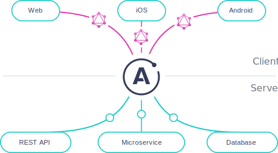
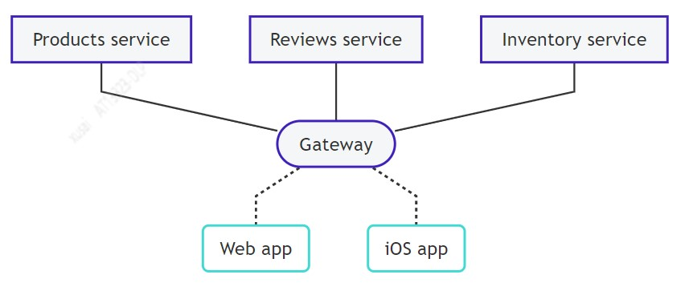

# ChartsQL
图表数据查询接口服务，GranphQL数据转换。


### 目录结构
```
----- ggls // gql文件
  |
  |-- src  // typescript语法开发目录
  |
  |-- lib  // typescript转译es5
  |
  |-- typings // 定义
  |
  |-- docs   // 文档
  |
  |-- config // 配置文件
  |
  |-- tsconfig.json
  |
  |-- package.json

```

### 开发配置
- ts-node + nodemon (热开发配置)
- graphql-import-node (import引入gql template)
- apollo-server


### GranphQL解决方案
- 基于typescript，appolo granphQl的接口改造方案

Apollo Server is an open-source, spec-compliant GraphQL server that's compatible with any GraphQL client, including Apollo Client. It's the best way to build a production-ready, self-documenting GraphQL API that can use data from any source.

<div align="center">

</div>

Apollo Server可使用的特性:
- 独立的GraphQL服务，包括在serverless环境中
- 对应用中现存的nodeJS中间件即插即用（例如支持express、fastify）
- 联邦数据图的网关

Apollo Server provides:
- Straightforward setup, so your client developers can start fetching data quickly
- Incremental adoption, allowing you to add features as they're needed
- Universal compatibility with any data source, any build tool, and any GraphQL client
- Production readiness, enabling you to ship features faster


### 应用场景指导

To get the most out of GraphQL, your organization should expose a single data graph that provides a unified interface for querying all of your backing data sources. This allows clients to fetch data from any number of sources simultaneously, without needing to know which data comes from which source.

As your data graph grows, however, it can become inefficient or even difficult to represent the graph with a single, monolithic GraphQL server. To remedy this, you can divide your data graph's implementation across multiple composable services with Apollo Federation.

Unlike other distributed GraphQL architectures (such as schema stitching), Apollo Federation uses a declarative programming model that enables each implementing service to implement only the part of your data graph that it should be responsible for. This way, your organization can represent an enterprise-scale data graph as a collection of separately maintained GraphQL services.


### 服务架构
An Apollo Federation architecture consists of:

- A collection of implementing services that each define a distinct GraphQL schema
- A gateway that composes the distinct schemas into a federated data graph and executes queries across the services in the graph

<div algin='center'>

</div>

### 核心思想
- 逐步采用
- 关注点分离

Apollo Server libraries
Apollo Server supports Apollo Federation via two open-source extension libraries:

- @apollo/federation provides primitives that your implementing services use to make their individual GraphQL schemas composable.
- @apollo/gateway enables you to set up an instance of Apollo Server as a gateway that distributes incoming GraphQL operations across one or more implementing services
